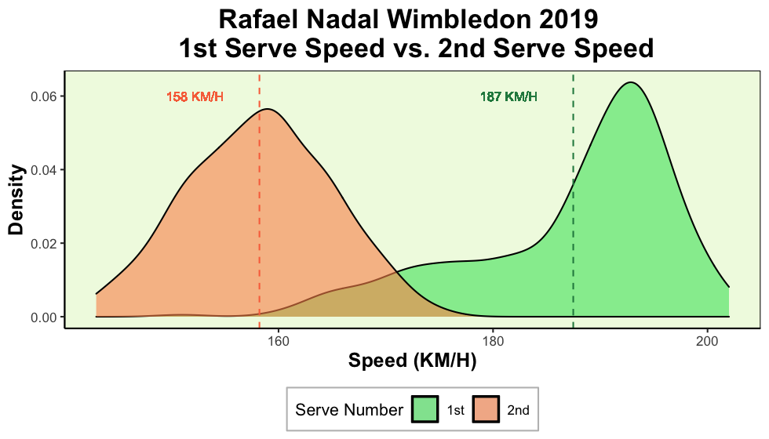
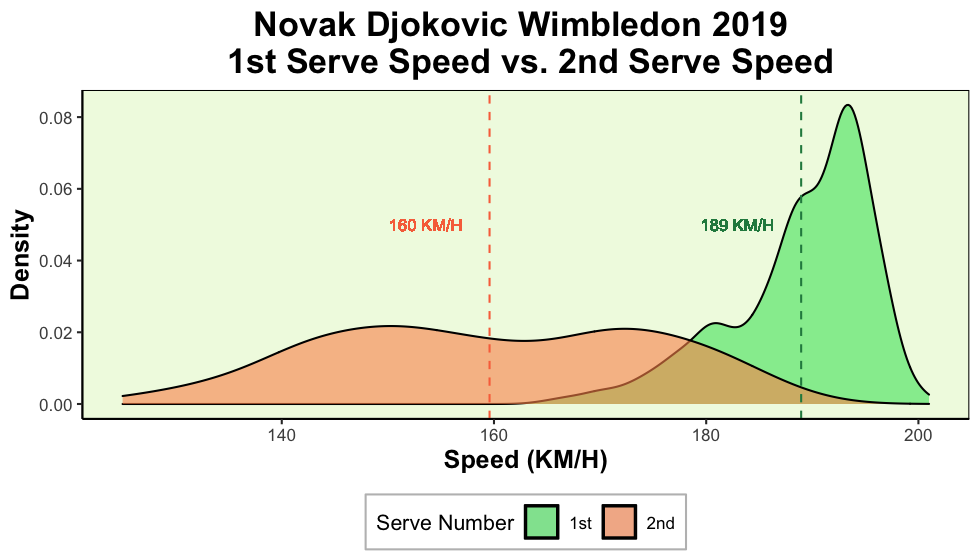
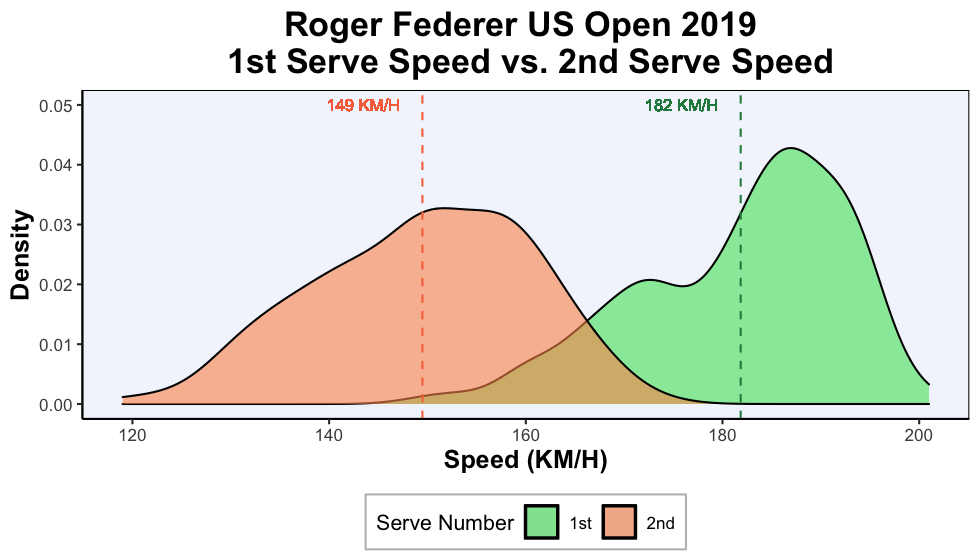
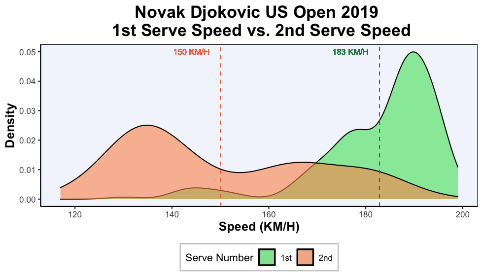

```{r setup, include=FALSE}
knitr::opts_chunk$set(echo = TRUE)
```

{}
**Attribution:** Special thanks to [Jeff Sackmann](http://www.tennisabstract.com/) for scraping and providing the data freely on his [Github page](https://github.com/JeffSackmann/tennis_slam_pointbypoint).
{}

# How do 1st serves differ from 2nd serves?
Tennis serve faults are a common occurrence in any competitive tennis match. Depending on whether a player is on their 1st or their 2nd serve, serving strategy is at the forefront of the player's decision making process in terms of how they want to attack their opponent. For instance, a player might choose a powerful serve that reduces the returner's reaction time and ultimately makes these serves more difficult for the opponent to return. However, these fast serves are difficult to hit accurately and have a higher likelihood of landing outside the service box, usually resulting in a service fault. Instead, a player might choose a slower serve, which are easier for the player to hit accurately and consistently. However, these slow serves allow a higher reaction time for the returner, and may also be more predictable and easier for the opposing player returning the serve. 

Moreover on 1st serve, the player is reassured that if they miss their 1st serve, they will still have a second opportunity to serve again without penalty. Hence, the risk-return tradeoff of attacking the opponent with a big and powerful serve is certainly manageable. However, if the player is instead on 2nd serve then they may be more wary of this tradeoff, as there are no more remaining serves in the particular game. The choice of a more powerful but inconsistent serve vs. a slower but consistent serve is paramount as the player approaches the service line.


In this project, we look closely into the service `` power-consistency`` tradeoff with a couple of data visualizations.


We will first present an exploratory analysis on serves from some familiar names from both the ATP and WTA worlds. From the ATP, we chose to look at ``Rafael Nadal``, ``Roger Federer`` and ``Novak Djokovic``. From the WTA, we chose to look at ``Serena Williams``, ``Simona Halep`` and ``Bianca Andreescu``. After some data cleaning and aggregating steps on match summary data found on Jeff Sackmann's [Github page](https://github.com/JeffSackmann/tennis_atp/blob/master/README.md), we produce the following analysis from Wimbledon and the US Open grand slam tournaments of 2019. 

```{r libraries, echo = FALSE, warning=FALSE,message=F}
library(dplyr)
library(ggplot2)
library(ggrepel)
```

```{r functions, echo=FALSE,warning=FALSE, cache = TRUE}
source("/Users/petertea/Documents/Sports-Analytics/Serve Speeds/Create_serve_plots.R")
source("/Users/petertea/Documents/Sports-Analytics/Serve Speeds/Tennis_Collection_functions.R")

```

## Observed 1st Serve Speed vs. 2nd Serve Speed at the 2019 Wimbledon Tournament 
```{r table, echo=FALSE, eval = FALSE}
RF_2019_Wim <- get_slam_serve(Player = "Roger Federer",
                              year = 2019, tournament = "wimbledon") %>%
  filter(ServeNumber >0 & Speed_KMH > 0 )

p_RF = create_serve_plot(my_data = RF_2019_Wim, 
                         Player = "Roger Federer", year = 2019, 
                         tournament = "wimbledon" )

png("RF_2019_Wim.png", units="in", width=7, height=4, res=140)  
p_RF
dev.off()


NJ_2019_Wim <- get_slam_serve(Player = "Novak Djokovic", 
                              year = 2019, tournament = "wimbledon") %>%
  filter(ServeNumber >0 & Speed_KMH > 0 )

p_NJ = create_serve_plot(my_data = NJ_2019_Wim, Player = "Novak Djokovic", year = 2019, 
                         tournament = "wimbledon")
#p_NJ <- p_NJ + scale_x_continuous(breaks = seq(min(NJ_2019_Wim$Speed_KMH),
#                                    max(NJ_2019_Wim$Speed_KMH), by = 10))

png("NJ_2019_Wim.png", units="in", width=7, height=4, res=140)  
p_NJ
dev.off()

RN_2019_Wim <- get_slam_serve(Player = "Rafael Nadal", 
                              year = 2019, tournament = "wimbledon") %>%
  filter(ServeNumber >0 & Speed_KMH > 0 )

p_RN = create_serve_plot(my_data = RN_2019_Wim, Player = "Rafael Nadal",
                         year = 2019, tournament = "wimbledon", y=0.06)
#p_RN <- p_RN + scale_x_continuous(breaks = seq(min(NJ_2019_Wim$Speed_KMH),
#                                    max(NJ_2019_Wim$Speed_KMH), by = 10))

png("RN_2019_Wim.png", units="in", width=7, height=4, res=140)  
p_RN
dev.off()
```

As an exploratory step, we first plot the observed distributions of 1st serve speeds compared to 2nd serve speeds during the 2019 Wimbledon tournament. Since tennis serves are unique for each individual player, we provide plots of tennis serve speeds for each player of interest. On the x-axis, we have the serve speed in kilometres per hour, and on the y-axis we have the observed density (i.e. the proportion of each observed serve speed). For each plot, the distribution of 1st serve speeds are plotted in green while the distribution of 2nd serve speeds are plotted in orange. On the plots, we also present the average 1st serve and 2nd serve speeds with vertical dashed lines.

### ATP Wimbledon 2019 Serve Speeds
Starting with the ATP players, we present the following serve speed distribution plots:







Note: From the dataset, both Novak and Roger played 7 matches while Rafa played 6 matches (Federer defeated Nadal in the semifinals, before falling to Djokovic in the finals).

```{r, calc_matches_played, echo=FALSE}
#wd = "/Users/petertea/Documents/Sports-Analytics/Sackmann/tennis_slam_pointbypoint"

#setwd(wd)
#matches_data <- read.csv("2019-wimbledon-matches.csv")

#matches_data %>%
#  group_by(player1) %>%
#  summarise(num_games = n()) %>%
#  filter(grepl(x=player1, pattern = "Nadal|Federer|Djokovic|Serena Williams|Halep"))

#matches_data %>%
#  group_by(player2) %>%
#  summarise(num_games = n()) %>%
#  filter(grepl(x=player2, pattern = "Nadal|Federer|Djokovic|Serena Williams|Halep"))
```


From the above 3 graphics, we make some simple remarks:

- For all 3 ATP players, the 1st serve distribution is left skewed, while the 2nd serve speed distribution appears more symmetric. The 1st serve skewed distribution indicates that on 1st serve, these 3 ATP players frequently serve at faster speeds than their average serve speed.


- The average 1st serve speed is consistently ``greater`` than the average 2nd serve speed. 

- With the exception of Novak Djokovic, the maximum 2nd serve speed is lower than the average 1st serve speed! Djokovic's 2nd serve speed has greater variance when compared to Roger and Rafa. Perhaps this has to do with Djokovic's strategy of being more unpredictable in his 2nd serves? 

- In any case, these 3 graphics indicate that these 3 ATP players tend to switch up their serve approaches given the situation of the match: On 1st serve, these players serve powerfully, but on 2nd serve these players serve more conservatively.


Moving on to the women's game, we observe similar patterns when we look at the 2 WTA players who reached the Wimbledon final (Halep defeated Williams). 

### WTA Wimbledon 2019 Serve Speeds
```{r pressure,echo=FALSE,  warning=FALSE, eval = FALSE}
### Serena Williams Wimbledon and Halep
SW_2019_Wim <- get_slam_serve(Player = "Serena Williams", 
                              year = 2019, tournament = "wimbledon") %>%
  filter(ServeNumber >0 & Speed_KMH > 0 )

p_SW = create_serve_plot(my_data = SW_2019_Wim, Player = "Serena Williams", year = 2019, tournament = "wimbledon",
                         x1 = 100 )

SH_2019_Wim <- get_slam_serve(Player = "Simona Halep",
                              year = 2019, tournament = "wimbledon") %>%
  filter(ServeNumber >0 & Speed_KMH > 0 )

p_SH = create_serve_plot(my_data = SH_2019_Wim, Player = "Simona Halep", year = 2019, tournament = "wimbledon",
                          x1 = 100 )

p_SW
p_SH                         

png("SW_2019_Wim.png", units="in", width=7, height=4, res=140)  
p_SW
dev.off()

png("SH_2019_Wim.png", units="in", width=7, height=4, res=140)  
p_SH
dev.off()
```


Note: From the dataset, both Williams and Halep played 7 matches. Halep defeated Williams in the finals.


Throughout the Wimbledon tournament, both Williams and Halep display distinct serve speeds depending on whether they are on their 1st or 2nd serve. The results are similar to what we've seen on the ATP serve graphics, however the first serve speed distributions here do not appear to be as left skewed as we've previously seen on the ATP graphics. 


### What are some possible implications of a slower 2nd serve speed?

Other than the speed of the serve, what else differs when players are serving on 1st serve, compared to when they serve on 2nd serve? We compile some summary statistics that compares the average serve speed, as well as the average win percentage, rally length and distance run by players when they are on 1st serve compared to when they are on 2nd serve. 

More specifically, we calculate the following:

- Δ Serve Speed (KM/H) = Average 2nd serve speed - Average 1st serve speed
- Δ Win percentage = % Points won on 2nd serve - % Points won on 1st serve
- Δ Rally Length = Average rally length on 2nd serve  - Average rally length on 1st serve
- Δ Distance Run = Average distance run on 2nd serve - Average distance run on 1st serve

| Player |Matches |Δ Serve Speed (KM/H) | Δ Win percentage  |  Δ Rally Length | Δ Distance Run
|---|---|---|---|---|---|
| Djokovic  | 7 | 🔻29|🔻19|❇️ 2.0   | ❇️ 6.0  | 
| Nadal  | 6 | 🔻29|🔻16| ❇️ 1.0  | ❇️ 3.0  | 
| Federer  | 7 | 🔻29|🔻15 | ❇️ 1.5  | ❇️ 4.0 |
| Williams | 7 | 🔻24|🔻14 | ❇️ 1.0  |  ❇️ 3.0 |
| Halep | 7 | 🔻28|🔻10| ▶️ 0.0  | ▶️ 0.0  |


From the above table, we can generate some interesting ideas about serve speeds. When we compare 2nd serves to 1st serves:

- Serve speed decreases
- Win percentage decreases
- Rally length increases
- Distance Run increases

How are all of these variables related to one another? We know that serve speed decreases as players go from their 1st serve to their 2nd serve. Furthermore, players tend to win a lower proportion of games as they play on their 2nd serves. Not only that but, the rallies that players are involved in are usually longer requiring more distance to run as players play on their 2nd serve. 

As players use a more consistent 2nd serve approach, their serve speed drops which makes the serve easier to return. The opposing player can now anticipate and return the serve, get into a groove more easily, and force the game into longer rallies. More rallies require the player to move more around the court and chase the ball which explains the increase in distance run. 


## US Open 2019 Serve Speeds

Inspired by these observed these patterns at Wimbledon, we then explore whether they exist in other tournaments where players play on different surfaces (Wimbledon is played on ``grass`` courts). To provide a partial answer to this question, we perform the same analysis using data from the 2019 US Open tournament, which is played on ``hardcourt``. 


### ATP US Open 2019 Serve Speeds
```{r ATP_USOpen_data,echo=FALSE,  warning=FALSE, eval=FALSE}
RN_2019_US <- get_slam_serve(Player = "Rafael Nadal",
                             year = 2019, tournament = "usopen") %>%
  filter(ServeNumber >0 & Speed_KMH > 0 )

p_RN2 <- create_serve_plot(my_data = RN_2019_US, Player = "Rafael Nadal", year = 2019, tournament = "usopen",
                           y=0.05)


png("RN_2019_us.png", units="in", width=7, height=4, res=140)  
p_RN2
dev.off()


RF_2019_US <- get_slam_serve(Player = "Roger Federer",
                             year = 2019, tournament = "usopen")%>%
  filter(ServeNumber >0 & Speed_KMH > 0 )

p_RF2 = create_serve_plot(my_data = RF_2019_US, Player = "Roger Federer", year = 2019, tournament = "usopen",
                          hp1 = -1.4, hp2 =3.4, vp1 = 2, vp2 = 2 )

png("RF_2019_us.png", units="in", width=7, height=4, res=140)  
p_RF2
dev.off()


NJ_2019_US <- get_slam_serve(Player = "Novak Djokovic", 
                             year = 2019, tournament = "usopen") %>%
  filter(ServeNumber >0 & Speed_KMH > 0 )

p_NJ2 = create_serve_plot(my_data = NJ_2019_US, Player = "Novak Djokovic", year = 2019, tournament = "usopen",
                          hp1 = 0.0, hp2 =3.35, vp1 = 3, vp2 = 3)

png("NJ_2019_us.png", units="in", width=7, height=4, res=140)  
p_NJ2
dev.off()

```


```{r, USO9_us.png)





From the 3 graphics above, we see that the 3 ATP players at the US Open all exhibit similar patterns observed during the Wimbledon grand slam tournament.


### WTA US Open 2019 Serve Speeds
```{r WTA_USOpen_data,echo=FALSE,  warning=FALSE, eval = FALSE}
SW_2019_US <- get_slam_serve(Player = "Serena Williams", 
                             year = 2019, tournament = "usopen") %>%
  filter(ServeNumber >0 & Speed_KMH > 0 )

p_SW2 = create_serve_plot(my_data = SW_2019_US, Player = "Serena Williams", year = 2019, tournament = "usopen",
                           x1 = 100 )

BA_2019_US <- get_slam_serve(Player = "Bianca Andreescu", 
                             year = 2019, tournament = "usopen") %>%
  filter(ServeNumber >0 & Speed_KMH > 0 )

p_BA = create_serve_plot(my_data = BA_2019_US, Player = "Bianca Andreescu", year = 2019, tournament = "usopen",
                        x1=100 )


png("BA_2019_us.png", units="in", width=7, height=4, res=140)  
p_BA
dev.off()

png("SW_2019_us.png", units="in", width=7, height=4, res=140)  
p_SW2
dev.off()

```


For completeness, we present the same table of numbers for the 2019 US Open tournament.

| Player |Δ Serve Speed (KM/H) | Δ Win percentage  |  Δ Rally Length | Δ Distance Run
|---|---|---|---|---|---|
| Djokovic  |🔻33|🔻13|❇️ 2.0   | ❇️ 5.0|
| Nadal  |🔻34|🔻18| ❇️ 3.0  | ❇️ 9.0  | 
| Federer  |🔻33|🔻22| ❇️ 2.0 | ❇️ 5.0 |
| Williams |🔻30|🔻17| ❇️ 1.0  |  ❇️ 4.0 |
| Andreescu |🔻21|🔻18|  ❇️ 1.0 | ❇️ 3.0|


[comment]: <> (▲)

### Evaluating consistency of 1st serves & 2nd serves

We've seen that 1st serves tend to be faster than 2nd serves, and players also tend to win more service games on 1st serves than on 2nd serves. You can imagine that if players serve as powerfully as they do on 1st serve throughout the entire match, perhaps they could win more service games. Unfortunately, the rate of success for hitting the powerful 1st serve is much lower than the rate of success for hitting the less powerful 2nd serve. We support this idea by presenting the percentages of serves that fall in the service box (i.e. serves that don't miss) for 1st serves compared to 2nd serves. We present these percentages below for 5 players obtained from the 2019 Wimbledon tournament.


| Player |% 1st serve in | % 2nd serve in  |
|---|---|---|---|---|---|
| Djokovic  | 75 | 88  |
| Nadal  | 73  | 93 | 
| Federer  |  75 | 94  | 
| Williams | 73 | 92 | 
| Halep | 76 | 91 |  

For these players, 1st serves consistently have a lower percentage of landing inside the service box than 2nd serves. This may be because players have a higher margin of error on 1st serve, and can afford to swing powerfully. However, on 2nd serve the margin of error is lower since a missed serve here would now result in a double fault (meaning the opponent wins the point).


[comment]: <> (So what are the tradeoffs of serve power vs. consistency?)
[comment]: <> (Maybe players are more comfortable (i.e. have more trust in) with their groundstroke game to win)

Powerful serves are more likely to land ``out``, which is why players tend to instead proceed with a more conservative, but more consistent 2nd serve approach.


## Further Analysis

It would be interesting to see if we can somehow model the serve power vs. consistency tradeoff.
In particular, we want to know: "Over the long run, which is the better strategy: Serving powerfully or serving consistently?" If players approached 2nd serves the same way as they do 1st serves where they serve as powerfully as they can, would this be a better strategy than a conservative 2nd serve approach? Or is the risk from this approach too high? Over the long run, how many games would a player expect to win if they were to use this approach?

In this report, we've only looked at unique tennis players at the top of the tennis world. Could we make some conclusions about all tennis players in general?


One simlple analysis we've done on combined data from all players participating in the 2019 Wimbledon tournament, is verifying that service win percentage differs between 1st serve and 2nd serve. We first present a contingency table with the number of service games won stratified across the serve number:

```{r chisqtest, echo=FALSE, warning=FALSE, comment =""}
dat <- read.csv("/Users/petertea/Documents/Sports-Analytics/Sackmann/tennis_slam_pointbypoint/2019-wimbledon-points.csv")

dat <- dat %>%
  mutate(Win = ifelse(PointWinner == PointServer, "Yes", "No")) %>%
  select(Win, ServeNumber) %>%
  filter(ServeNumber != 0) %>%
  table() 

dat
```

Then, using a chi-square test, we obtain a p-value less than 0.05. We conclude that there exists some relationship between win percentage and the serve number. Players on 1st serve are more likely to win, compared to when players are on their 2nd serve.


