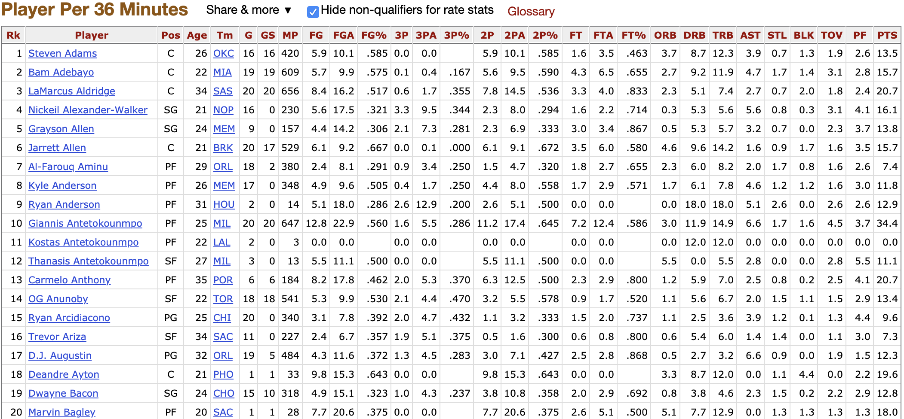

```{r setup, include=FALSE}
knitr::opts_chunk$set(echo = TRUE)
```

## Let's Ball

As a fan of the **NBA** and an enthusiastic **R** user, I've spent some time scouring the internet for ways to obtain useable data to load into R - mainly from the popular data source [Basketball-Reference](https://www.basketball-reference.com). Unsatisfied with my online data quest, I just decided to scrape the data on [Basketball-Reference](https://www.basketball-reference.com) myself! The process is pretty straightforward, as you will see shortly...

Firstly, as the entire contents of a [Basketball-Reference](https://www.basketball-reference.com)
web page is written in HTML format, you can easily save the entire content and load it into R. However, it simplifies things greatly if we can be more selective in the contents we want to load into R. HTML files contain ``tags`` that pretty much denotes different content of the HTML page. If you can find the speficic tag for the table you want to save in R, then you're golden! Take for example this table that shows the latest (as of November 28, 2019) player boxscore stats per 36 minutes.



How can we extract only the information found in the above table? To do that, we can simply use a chrome tool called [SelectorGadget](https://chrome.google.com/webstore/detail/selectorgadget/mhjhnkcfbdhnjickkkdbjoemdmbfginb?hl=en). By using this plug-in, we can simply highlight the specific content of the page we want saved, and export it into R.

First, let's load in two R packages:

 - rvest:
 - dplyr:
```{r, load, message=FALSE}
#install.packages("rvest")
library(rvest)
library(dplyr)
```


```{r, A1, tidy.opts=list(width.cutoff=65)}
my_url <- read_html("https://www.basketball-reference.com/leagues/NBA_2020_per_game.html")
node <- "#per_game_stats a , .right , .center"

```

Let's look at the first 30 elements of our compiled data:
```{r, A2}
scraped_data <- my_url %>%
  html_nodes(node) %>%
  html_text()

my_variable_names <- scraped_data[1:30]

print(my_variable_names)

```
These names match exactly the first 30 elements of the table we want to extract.

Just as an FYI, the data is saved as a ``vector`` in r, with ``14,341`` entries.
```{r, A3}
is.vector(scraped_data)
```

```{r, A33}
length(scraped_data)
```

\vspace{50pt}

Some of the variable names begin with numbers which is a huge **no-no** in R, so let's manually change these names:
```{r, A4}
my_variable_names[12:17] <- c("Threes_made", "Threes_attempted",
                              "Threes_percent", "Twos_made",
                              "Twos_attempted", "Twos_percent")
```


We will use this vector data to fill in an empty table we create in R. We have to note though, that due to the way we've scraped the data there exists some garbage we must remove. If you look carefully, the table repeats the variable names after every 20th player.
I'll illustrate below: 

```{r, A5}
scraped_data[600: 660]
```


To remove this junk, I'll simply create a vector of indices that correspond to the junk we want removed. After some investigating skills, we can see that it's every 600th - 630th element that we need to remove.
```{r, A6}
to_remove <- 631:660
n <- length(scraped_data)

while(to_remove[length(to_remove)] <= n - 601 ){
  
  A <- to_remove[length(to_remove)] + 601
  to_add <- A:(A+29)
  to_remove <- c(to_remove, to_add)
  
}
```

```{r, A7}
process_dat <- scraped_data[-to_remove]
```

We can check that we have reduced our data vector:
```{r, A8}
n2 <- length(process_dat)
print(n2)
```

Awesome, now we'll get to work on filling in a data-frame with this cleaned data. The way I did it was to specify the elements that should be added row-wise to a data table in R. I.e. every 30 elements makes up one row in our table:
```{r, A9, warning=FALSE}
my_index <- seq(from = 31, to = n2, by = 30)

#Initialize data frame...
my_data <- data.frame(matrix(ncol = 30, nrow = 452))
# Note the dimensions here are found by looking at the table on basketball-
# reference.


# Loop to add each row to the data frame
for (i in 1:length(my_index)){
  current_ind <- my_index[i]
  my_data[i,] <- process_dat[current_ind:(current_ind+30)]
}


colnames(my_data) <- my_variable_names
```

Let's take a look at what our table looks like:
```{r, A101}
knitr::kable(my_data[1:5,], caption = "Our data")
```


One last step required! All columns in my table are type ``chr``. We want to change the columns that are numeric into a numeric type!
```{r, A10}
str(my_data)
```


```{r, A11}
my_data[, c(4, 6:30)] <- sapply(my_data[, c(4,6:30)], as.numeric)
str(my_data)
```


Awesome! Let's take a look at what our table looks like...
```{r, A111}
my_data <- as_tibble(my_data)

```

```{r, A12}
my_data <- my_data %>%
  mutate(FP = -0.2*MP - 0.5*FGA + 
           0.75*Threes_made + PTS +
           1.5*ORB + DRB + 1.5*AST +
           2.5*STL + 2.5*BLK - TOV)

```

```{r, A122}
FP_data <- my_data %>%
  select(Player, Tm, FP) %>%
  arrange(desc(FP))

knitr::kable(FP_data[1:10,], caption = "Fantasy Data")
```

```{r, A13}

```

