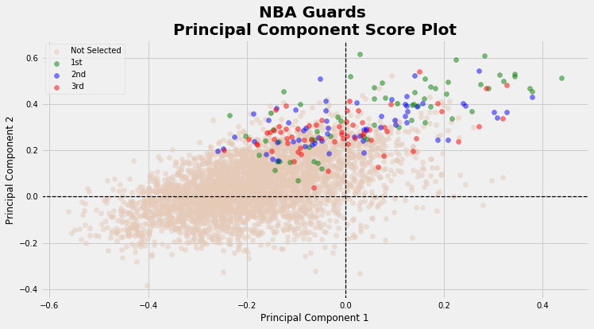
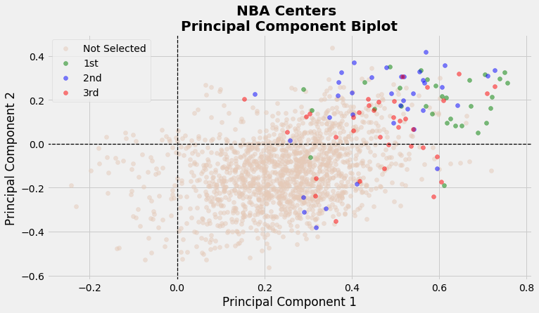
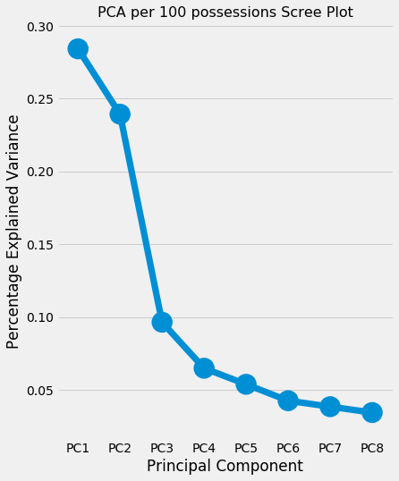
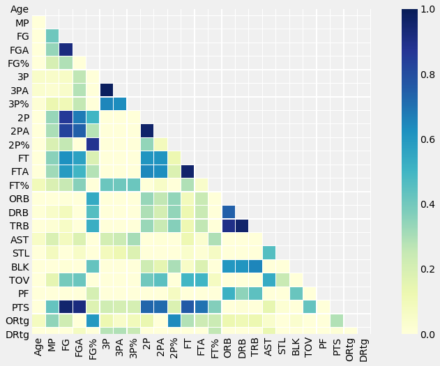

```{r setup, include=FALSE}
knitr::opts_chunk$set(echo = TRUE)
```

## All-NBA Team

The All-NBA award is an interesting way we keep track of the best stars in the game. Voted on by reporters and members of the media, 15 players are chosen at the end of each season to occupy 3 All-NBA teams. 6 Guards, 6 Forwards and 3 Centers place high up in the clouds and marked as the best among their peers.

Outside of being the top 15 players, what are the defining features of an All-NBA player? What do players have to accomplish in order to be considered for this prestigious award? Is there anything that separates a player on the 1st All-NBA team from a player on the 2nd or 3rd All-NBA teams? Have there been any egregious snubs for this award in the past? To answer these pressing questions, we first turn to Principal Component Analysis for guidance on distinguishing general patterns among All-NBA players.

## Table of contents
1. [Principal Component Analysis](#pca)
2. [Data: Per 100 Possessions](#per_100_poss)
3. [PCA Visualizations](#vision)
4. [Closing Remarks](#conclusion)


### Principal Component Analysis <a name="pca"></a>

Among many potential capabilities, principal component analysis (PCA) can be used as a simple visualization tool when we have a myriad of continuous features to consider. In our case, we have several recognizable box score metrics like points scored, rebounds and assists standardized on a per 100 possessions rate that we’ll explore. 

PCA is an unsupervised algorithm that is able to summarize a set of correlated, continuous variables into a lower-dimensional representation that is easier to visualize. In some sense, we are compressing the data into a compact form that hopefully captures most of the variability in the data. With PCA, we’ll investigate which combination of features best explain the variability of NBA player performances across different seasons.


### Per 100 Possessions Data  <a name="per_100_poss"></a>

While most box-score metrics are available at the end of each season on a per game basis (ex: Points per game), using a per game standard makes it challenging to compare performances of players under different team styles of basketball.  For example, recently we’ve seen an emphasis on up-tempo and spread out offence largely popularized by coach Mike D’Antoni. The modern NBA offence has seen an explosion in the volume of shots taken each game, especially beyond the arc. Pace of play is much faster now than what it was even 10 years ago, making it extremely difficult to also compare players from different eras.

One stat that might allow us to better compare players under different offence styles is the per 100 possessions metric. This metric standardizes each player's opportunity to fill the stat sheet, by exactly measuring how well players perform per 100 possessions rather than by game. Here, players who stuff the stat sheet with fewer opportunities will now appear more favourable than players who had more opportunities to accumulate box-scores.

We obtain per 100 possessions data through Basketball Reference, with the help of the ``bball`` R package.


### Data Preparation

Since the inception of 3 separate All-NBA teams started in 1989, we begin collecting data from 1989 until the past 2019 season. The nomination of All-NBA teams started well before 1989, however only included 2 All-NBA teams.

To remove as much noise and outliers as possible, we’ve decided to only include players that satisfy the following two conditions:

1.	Played in at least 10 games
2.	Averaged at least 15 minutes played per game

Applying the above two filters reduced the size of the data from 12913 to 9126 observations. In total, we chose to look at 25 continuous features.


### PCA Visualizations  <a name="vision"></a>

After standardizing each feature to have a mean of 0 and standard deviation of 1, we then apply the PCA algorithm through the ``Scikit-learn`` library in Python. We will first focus on visualization across the first 2 principal components, as it is easier to represent data in 2-D.

Each ``principal component`` is simply a normalized linear combination of the 25 features, found by maximizing a variance objective function. Subsequent principal components are found with the added constraint that they are orthogonal to the previous principal components. ``Loadings`` are the weights for each of the 25 features relative to a principal component.

With a PC Loadings plot of the first and second principal components, we depict the directions in feature space along which the data vary the most. Each loadings vector shows the relative importance/weight that both principal components place on the 25 features.


From this loadings plot, we see that Principal Component 1 (PC1) places its highest weights on rebounds, blocks, and field goal percentages (i.e. highest loading values along the x-axis). Hence, players with high PC1 scores might roughly correspond to players who can crash and bang in the paint, grab rebounds, alter shots at the rim and maybe even show some nice efficiency in finishing easy buckets near the rim.  Interestingly, features with highly negative weights along this principal component include 3 pointers made and attempted, steals and assists which all summarize typical characteristics among traditional Guards (i.e. perimeter players).

Similarly, we see that Principal Component 2 (PC2) places its highest weights on points, field goals, field goal attempts and free throws made (i.e. highest values along the y-axis). We shouldn’t be too surprised to see all four of these variables located closely to one another since they are somewhat all correlated. Eventually as players take more and more shots, this will increase the number of field goals made which in turn will increase the number of points scored for that player. Players with high PC2 scores might correspond to players vying for scoring titles.


How do the players, and more importantly the all-NBA players, fit along this 2-D representation? 
For each of the n=9126 observations, we plot the ``scores`` of the first principal component along the x-axis, and the scores of the second principal component along the y-axis.

Let’s first take a look at the scores for guards. 



Here we see a clear distinction of players who make All-NBA compared to those who don’t. While the majority of guards tend to have negative scores along the PC1 axis, about half of the All-NBA guards have highly positive PC1 scores. This might indicate that having higher versatility, that is the ability to not only facilitate plays but also score and grab rebounds, might lead to an All-NBA player. Of course, we do see a sizeable amount of guards placed near the direction favouring steals and assists so having higher versatility is certainly not a necessary condition for a guard to be All-NBA. Surprisingly, there does not appear to be an obvious pattern of players on 1st team All-NBA compared to the 2nd and 3rd teams.


Moving onto Forwards, we see that most forwards seem to fit anywhere on this plot. However, majority Forwards who end up making All-NBA are found in the upper right quadrant with high PC1 and PC2 scores. In fact, it seems like having higher scores on both these axes is related to Forwards on the 1st All-NBA team. We see a bit more disparity of the 3 All-NBA teams on this plot.



Lastly for centers we see that they are placed mostly on the right side of this biplot. This is intuitive since most centers are not adept in steals, assists or 3 pointers (ahem Tragic Johnson alert). Most All-NBA players have positive PC2 scores, especially centers who make the 1st All-NBA team. Centers tend to grab more rebounds and block more shots, so it is not a surprise to see their scores be far along the right of the x-axis.


So far, we’ve only considered a two-dimensional representation of the p-dimensional data for simplicity. However, does 2 dimensions successfully capture the major patterns in the data? How much information is lost by projecting the observations onto only the first two principal components? That is, how much of the variance in the data is not contained in the first few principal components? To answer these important questions, we present a scree plot which depicts the proportion of variance explained by each of the principal components. 




We see that the first principal component explains about 28 % of the variance in the data, and the second principal component explains 24 % of the variance. Together, the first two principal components explain almost 52 % of the variance in the data; just over half of the entire variance.
The third principal component accounts for under 10 % of the variance, while the remaining principal components each slightly hover above or are below 5 % of the total variance. 

While the first two dimensions does miss out on a sizeable amount of variance, it does still provide an okay summary of the data. The convenience of plotting in only two dimensions is of course why we focussed merely on 2 principal components. The 3rd principal component explains less than half of either of the first two principal components, so it was not worthwhile to pursue an added layer of dimensionality with so little upside.


### Closing Remarks  <a name="conclusion"></a>

So, what have we learned from looking at these plots? Essentially, Forwards and Centers who get more rebounds, blocks, points and field goal makes are more likely to be All-NBA caliber players. Furthermore, extra versatility for guards might make them All-NBA bound, but guards that excel under a traditional guard role can still vie for the all-NBA. In other words, the Earth is round, rain makes roads wet and Kawhi is still on load management. So much for making deep impressions on the game of basketball. While this isn’t ground-breaking results, it is still interesting to visualize specifically the tendencies of All-NBA players. 

### Appendix

Biplots combine both loading and score plots in a single display. They might be easier to analyse since everything is on a single plot, but I find them to be a bit clunky especially with many features plotted.


To visualize relationships between continuous features, it might be appealing to look at pairwise correlation plots. The issue though is that with many continuous features included, these plots can get overloaded and difficult to visualize. In this project we only had 25 features to consider, which isn't too bad.     




