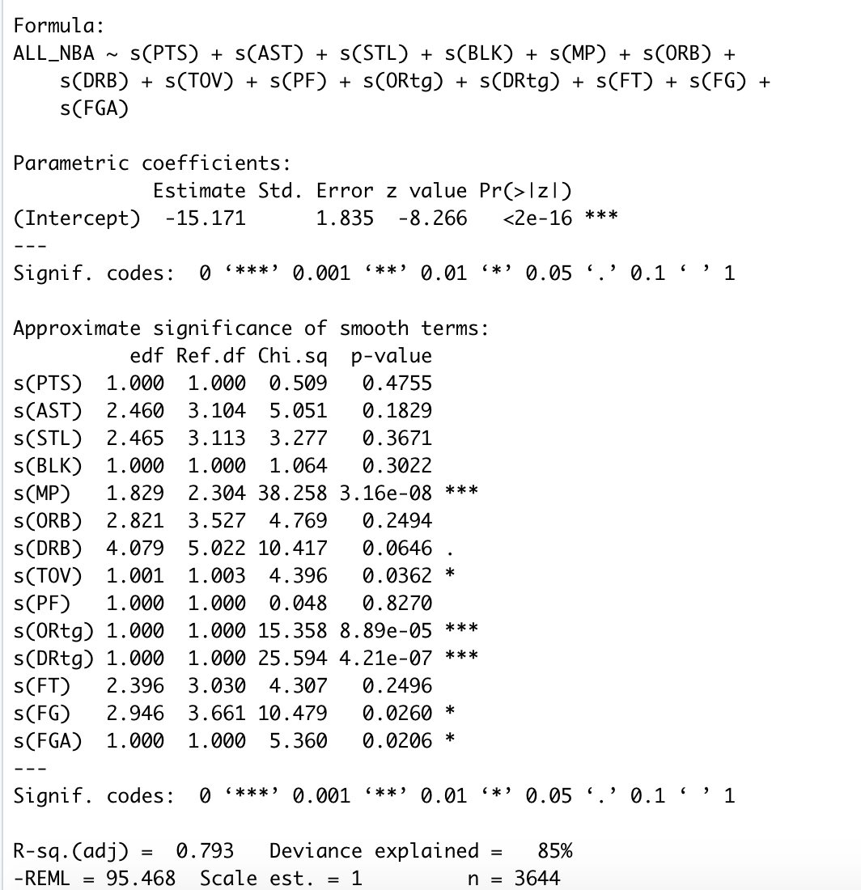

```{r setup, include=FALSE, eval=FALSE}
knitr::opts_chunk$set(echo = TRUE)
```
# All-NBA Selection


## Table of contents
1. [Introduction: All-NBA Selection](#introduction)
2. [Obtaining/Scraping Data](#data)
3. [Exploratory Data Analysis](#EDA)
4. [Fitting GAM Model](#gam)


### All-NBA Selection <a name="introduction"></a>
The All-NBA team is an annual NBA distinction awarded to players with outstanding peformances at the end of each NBA season. Since the 1989 season, the All-NBA team is composed of three sub All-NBA teams (i.e. 1st All-NBA, 2nd All-NBA and 3rd All-NBA) where each team is composed of 2 guards, 2 forwards and 1 center. In total, 6 guards, 6 forwards and 3 centers are selected for the All-NBA team.

Selection is controlled by a panel of sportswriters and broadcasters (i.e. the media) who select players for the All-NBA 1st, 2nd and 3rd Teams by position. A tally of all the votes are then taken to determine the results of All-NBA selections for all three teams. Players placed on a 1st All-NBA team ballot are awarded 5 points, while players placed on a 2nd All-NBA team ballot are awarded 3 points and 1 point for a 3rd All-NBA team ballot. The implications of the All-NBA team are not only of financial incentive, but also for reputation as inclusion to this team might validate the stardom of NBA players.


In this project, we build models to predict which players will form all 3 All-NBA teams. We first collect end-of-season boxscore statistics since the 1989 NBA season to train and test our prediction models. Then, we make our predictions for the All-NBA team for this current 2020 NBA season. We decided to look at statistics on a *per 100 possessions* metric to account for fluctuating pace of play across different NBA seasons. 


## Obtaining/Scraping NBA Data <a name="data"></a>
We first scrape historic end-of-season boxscore statistics for NBA players using the [``bballR``](https://rdrr.io/github/bobbyingram/bballR/) R package. As stated previously, we are interested in box-score metrics on a *per 100 possessions* scale, which the bballR R package can easily provide.


### 1989 - 2019 Player per 100 possessions Data 
We first present code on collecting end-of season box-score statistics (*per 100 possessions*), and saving them into ``.RDS`` files using the bballR R package. We decide to only keep player seaason records where the player played at least 100 minutes. We add in this criterion since having players who play limited minutes are likely not going to be considered for the All-NBA teams. 

```{r collect_data, warning=FALSE, message=FALSE, eval=FALSE}
##### --------------- Using bballR package to scrape historical data --------------- #####

setwd("/Users/petertea/Documents/NBA/Data")
# --> Set current working directory to where we want to save data

# Use the bballR package to gather some end of season boxscore stats
install.packages("remotes")
remotes::install_github("bobbyingram/bballR")

# --> Load all libraries we will need
library(bballR)


# --> First scrape key data outlining info on all NBA players (this may help with merging datasets later on)
players_dat <- bballR::scrape_all_players()

# --> Save file
saveRDS(players_dat, file = "players_dat.RDS")
# Data Key: https://rdrr.io/github/bobbyingram/bballR/man/scrape_all_players.html


# --> Second, scrape end of season boxscore statistics (per 100 possessions) from the 1989 season to the previous 2019 NBA season.

for (year in 1989:2019){
  filename = paste("NBA_", year, "_P100P.RDS", sep = "" )
  saveRDS(bballR::scrape_season_per_100_poss(year), file = filename)
}
#https://rdrr.io/github/bobbyingram/bballR/man/scrape_season_per_100_poss.html


# --> Combine all seasons into a single "master file"
# --> Only include players who played more than 100 minutes a season
Historical_dat_1989_2019 <- data.frame()
for( year in 1990:2019){
  dat <- readRDS(paste("NBA_", year, "_P100P.RDS", sep = "" ))
  
  dat <- dat %>%
    filter(MP > 100) %>% 
    filter(Tm != "TOT") %>%
    mutate(Year = year)
  
  Historical_dat_1989_2019 <- rbind(Historical_dat_1989_2019, dat)
  
}
```


### 1989 - 2019 All-NBA Player Selections

The previous code saved each season's per 100 possesion box-score statistics in separate .RDS files. Now, we will need to scrape data that indicates which players won All-NBA team awards at the end of each season. Unfortunately, the bballR R package does not include functions that scrape this type of information for us. Instead, we will scrape this information ourselves.

A list of All-NBA teams can be found on [basketball-reference](https://www.basketball-reference.com/awards/all_league.html). We will use the ``rVest`` R package to scrape this data into a clean .RDS file as shown in the code below:

```{r, allplayers, warning=FALSE, message=FALSE, eval = FALSE}
# ----- Get list of player names who made the ALL - NBA Teams ----- #
library(rvest)
library(dplyr)

my_url <- read_html("https://www.basketball-reference.com/awards/all_league.html")
node <- "tbody .left , .right"
# Node found using InspectorGadget chrome tool.

scraped_data <- my_url %>%
  html_nodes(node) %>%
  html_text()

dummy<- scraped_data[1:984]
# Anything past the 984th element of the list is not required

# Remove empty elements from the list
to_remove <- c()
for (i in seq(from=25, to = 953, by = 32)){
  ind <- seq(from = i, to = i+7, by = 1)
  to_remove <- c(to_remove, ind)
}

dummy <- dummy[-to_remove]

# Remove entries that indicate type of All-NBA team awarded
to_remove2 <- which(grepl("0|1|2|3|NBA", dummy))
players <- dummy[-to_remove2]


# Initialize data frame...
year <- rep(2019:1989, each = 15)
team <- rep(rep(1:3, each = 5), times = 31)


ALL_NBA_data <- data.frame(Year = year, Team = team, Player = players, stringsAsFactors = F) %>%
  mutate(Position = substr(Player, start = nchar(Player), stop = nchar(Player)),
         Player = substr(Player, 1, nchar(Player) - 2)
         ) 
```


Now that we have collected historic box-score statistics after each NBA season, and also collected the names of the players who won All-NBA after those seasons, the next step is to combine these two datasets together.

```{r, combine_data, eval=FALSE}
# Create an ID that will match the box-score dataset
to_test <- paste(ALL_NBA_data$Player, ALL_NBA_data$Year, sep ="-")

# Add column of 1 if player made All-NBA that season, and 0 if they did not.
# Also, adjust position to be G, F or C.
Historical_dat_1989_2019 <- Historical_dat_1989_2019 %>%
  mutate(ID = paste(Player, Year, sep = "-"),
         ALL_NBA = ifelse(ID %in% to_test, 1, 0),
         New_Pos = ifelse("G" == substr(Pos,2,2), "G", ifelse("F" == substr(Pos,2,2), "F", "C") ))

#Historical_dat_1989_2019 %>% group_by(Year) %>%
#  summarise(n = sum(ALL_NBA)) %>% View()
# --> Two years have "16" players winning All-NBA
# --> This is just one player being traded during season (playing for two different teams)

saveRDS(Historical_dat_1989_2019, file = "Historical_dat_1989_2019.RDS")
```


### Current 2020 Player per 100 possessions Data 
Later on in our report, we will predict who will be included in this year's All-NBA team. To do this, we will need to scrape the current season box-score statistics (per 100 possessions). Again, we will use basketball-reference and the R package ``rVest``.

```{r, current_data, eval=FALSE}
##### ----- Get current per 100 possession season stats ----- #####
my_url <- read_html("https://www.basketball-reference.com/leagues/NBA_2020_per_poss.html")

node <- ".left , .right , .center"


scraped_data <- my_url %>%
  html_nodes(node) %>%
  html_text()

# Remove the "Rk" column from data
Rk_ind <- which(scraped_data == "Rk")[-1]

#Remove all unnecessary bits
to_remove = c()
for ( i in Rk_ind){
  to_remove = c(to_remove, i:(i+31))
}

scraped_data <- scraped_data[-to_remove]

each_row <- seq(from = 33, to = 15906,  by = 32)
col_names = scraped_data[1:32]

dat = matrix(ncol = 32)
for (i in each_row){
  dat <- rbind(dat, scraped_data[i:(i+31)])
  
}

colnames(dat) <- col_names

Current_season_dat <- as.data.frame(dat, stringsAsFactors = FALSE)
Current_season_dat[c(4, 6:32)] <- sapply(Current_season_dat[c(4, 6:32)], as.numeric)

saveRDS(Current_season_dat, file = "Current_season_dat.RDS")
```


## Exploratory Data Analysis <a name="EDA"></a>

After all that heavy lifting, we now present some basic exploratory data analysis on our collected data. For the purposes of this project, we decided to focus only on players who have played at least 100 minutes in a given season. This condition removes players who are not full-time NBA players and hence better represents a sample of NBA players who are more inclined to be selected for the All-NBA teams. 

We first present a simple correlation plot between 14 different boxscore metrics for these NBA players. These metrics include:

- PTS: Points scored per 100 possessions
- AST: Assists per 100 possessions
- STL: Steals per 100 possessions
- BLK: Blocks per 100 possessions
- MP: Minutes played
- ORB: Offensive rebounds per 100 possessions
- DRB: Defensive rebounds per 100 possessions
- TOV: Turnovers per 100 possessions
- PF: Personal fouls per 100 possessions
- ORtg: Offensive rating (An estimate of points produced per 100 possessions)
- DRtg: Defensive rating (An estimate of points allowed per 100 possessions)


```{r, load_data}
# Read in our Data:
Historical_dat_1990_2019 <-readRDS("/Users/petertea/Documents/NBA/Data/Historical_dat_1989_2019.RDS")

Current_season_dat <- readRDS("/Users/petertea/Documents/NBA/Data/Current_season_dat.RDS")
```

```{r, EDA, message=FALSE}
###########
# --> Exploratory correlation plot b/n variables
library(ggcorrplot)
library(dplyr)

corr_mat <- Historical_dat_1990_2019 %>%
  select(PTS, AST, STL, BLK, MP, ORB, DRB, TOV, PF, ORtg, DRtg) %>%
  cor() %>%
  round(1)


ggcorrplot(corr_mat, type = "lower", colors = c("#FF0000", "#FFFFF0" , "#4169E1"),
           outline.col = "black", lab = T, ggtheme = theme_classic(),
           title = "Correlation of per 100 possession boxscore stats",
           legend.title = "Correlation",
           lab_size = 3)
```

From the correlation plot above, we see that there exists strong linear relationships between a player's Offensive Rebounding numbers with their Defensive Rebounding numbers and number of Blocks. This is unsurprising since players who grab rebounds and block shots tend to be near the rim, and hence will have a tendency to perform both roles of grabbing rebounds and blocking shots. Turnovers and assists also tend to be related as well since decision makers whose job is to set up their teamates through assists, may be more liable to turn the ball over as well.


## Fitting GAM Models <a name="GAM"></a>

To predict whether a player will be selected or not for an All-NBA team, we use GAM models. In the context of our problem, a GLM (i.e. logistic regression) could be used to estimate the log odds (a function of a success probability) of a player reaching All-NBA status, given his in season performance. However, GLM models assume a linear relationship (i.e. a parametric form) between the covariates and the log-odds of All-NBA selection which may not be true. GAM models on the other hand do not assume a priori any specific structure for the relationship between boxscore stats and the outcome of All-NBA selection. In fact, GAMs can be used to model non-linear effects of the covariates on the response variable. In a sense, we can consider GAM models as a more flexible version of GLM models. GAMs have the abililty to model these non-linear relationships using spline functions. More information on GAMs can be found [here](https://christophm.github.io/interpretable-ml-book/extend-lm.html).


Since the relationship between our proposed covariates and the outcome of All-NBA selection may be different based on position (eg: Assists and steals may be more important for Guards, while blocks and rebounds may be more important for Centers), we fit 3 seperate GAM models for the Guard, Forward and Center positions.

To further reduce noise, we also only chose to look at player season records where the player played atleast 5 games (in addition to playing at least 100 total minutes). The rationale is that players who do not meet the above criteria are likely not considered from All-NBA selection.

```{r, filtre_dat, message=FALSE, warning=FALSE}
Historical_dat_1990_2019 <- Historical_dat_1990_2019 %>%
  filter(G > 5 & MP > 100)
```

Next up, we'll set up our training and testing sets to inform us on the quality of the fit of our models. We chose the conventional 70 % split for the training set and 30 % to the test set. To ensure that there are an adequate amount of outcomes in each of the training and test sets, we allocate total years to each set. That is, since we have a total of 31 years, we allocate 0.3 x 30 = **9 years** of data to the testing set and the remaining **22 years** of data to the training set.


To evaluate the predictive performances of our GAM models, we look at their classification rates on the testing set. Here, in our calculations for classification rates, we will only consider the amount of correct All-NBA predictions. That is, among the players who actually won All-NBA, how many did we correctly predict that they would win. A classification rate that considers correct classification among those who did not win All-NBA would not be very informative since the majority of players do not win All-NBA. 

```{r, train_test_split, message=FALSE, warning=FALSE}
# Create Training (70%) - Testing (30%) split
# In total, we have 30 years of data.
# --> Training set will have 21 years worth of data, Testing set will have 9 years worth of data 

set.seed(824)
# --> RIP Kobe and Gianna Bryant

# Randomly select 9 years:
possible_years <- 1990:2019

test_years <- sort(sample(x=possible_years, size = 9))

train_years <- sort(possible_years[is.na(pmatch(possible_years, test_years))])
```


### Guards GAM Model
Here is the fitting of a GAM model to the Guards belonging to our training set.

```{r, guards_gam, message=FALSE, warning=FALSE, eval=FALSE}
###### ----- Guards GAM Model Analysis ----- #####
Guards_train_dat <- Historical_dat_1990_2019 %>%
  filter(New_Pos == "G" & Year %in% train_years)

Guards_test_dat <- Historical_dat_1990_2019 %>%
  filter(New_Pos == "G" & Year %in% test_years)


# Build model and assess predictive ability:

# --> Guards GAM Model
guards_mod <- gam(ALL_NBA ~ s(PTS) + s(AST) + s(STL) + s(BLK) + s(MP) + 
                    s(ORB) + s(DRB) + s(TOV) + s(PF) + s(ORtg) + s(DRtg) + 
                    s(FT) + s(FG) + s(FGA),
                  data = Guards_train_dat,
                  family = binomial,
                  method = "REML")

# --> Use fitted model on testing dataset
# --> Predict probabilities of All-NBA selection
predicted_probs <- predict(guards_mod, Guards_test_dat, type = "response")  

Results_G_dat <- cbind(Guards_test_dat, predicted_probs)

# How many of our classifications are correct?
# Each year, 6 guards win an All-NBA selection

correct_G_vector <- vector()
for(year in test_years){
  how_many <- Results_G_dat %>%
    filter(Year == year) %>%
    arrange(desc(predicted_probs)) %>%
    select(ALL_NBA) %>%
    head(6) %>%
    sum()
  
  correct_G_vector <- append(correct_G_vector, how_many)
}
names(correct_G_vector) <- test_years
correct_G_vector
sum(correct_G_vector/ (9*6))
```

The summary of our fitted Guards GAM model is shown below. To inspect the degree of ``wiggliness`` in our fitted model, we look at the edf (estimated degrees of freedom). Terms with edf values equal to 1 represent fitted splines which are linear; edf values equal to 2 represent fitted splines which are quadratic; larger edf values represent splines that are increasingly non-linear (i.e. higher EDF value implies more complex splines). In our model, the 5 statistically significant covariates (at level 5%) all have edf > 1. 


From the summary of this Guards GAM model, we see that ``Assists`` ``Minutes`` and ``Defensive Rating`` were the strongest influencers on whether a guard was awarded All-NBA. Additionally, 80.4 % of the deviance was explained by this model. Using our fitted model, we predict how well it classifies All-NBA selection in our testing set. 

Testing set Year |1990 | 1993 | 1994 | 1996 | 1999 | 2000 | 2002 | 2005 | 2010 | 
|---|---|---|---|---|---|---|---|---|---|
No. correct classifications |  5   | 5   | 3 |   4   | 4 |   3 |   5 |   5 |   5 |


Since 6 guards are chosen for All- NBA each year, our predictions correspond to an overall classification rate of 72 % in the testing dataset.

### Forwards GAM Model
Here is the fitting of a GAM model to the Forwards belonging to our training set.

```{r, forwards_gam, message=FALSE, warning=FALSE, eval=FALSE}
###### ----- Forwards GAM Model Analysis ----- #####
Forwards_train_dat <- Historical_dat_1990_2019 %>%
  filter(New_Pos == "F" & Year %in% train_years)


Forwards_test_dat <- Historical_dat_1990_2019 %>%
  filter(New_Pos == "F" & Year %in% test_years)


# Build model and assess predictive ability:

# --> Forwards GAM Model
Forwards_mod <- gam(ALL_NBA ~ s(PTS) + s(AST) + s(STL) + s(BLK) + s(MP) + 
                    s(ORB) + s(DRB) + s(TOV) + s(PF) + s(ORtg) + s(DRtg) + 
                    s(FT) + s(FG) + s(FGA),
                  data = Forwards_train_dat,
                  family = binomial,
                  method = "REML")

# --> Use fitted model on testing dataset
# --> Predict probabilities of All-NBA selection
predicted_probs <- predict(Forwards_mod, Forwards_test_dat, type = "response")  

Results_F_dat <- cbind(Forwards_test_dat, predicted_probs)

# How many of our classifications are correct?
# Each year, 6 guards win an All-NBA selection

correct_vector_F <- vector()
for(year in test_years){
  how_many <- Results_F_dat %>%
    filter(Year == year) %>%
    arrange(desc(predicted_probs)) %>%
    select(ALL_NBA) %>%
    head(6) %>%
    sum()
  
  correct_vector_F <- append(correct_vector_F, how_many)
}
names(correct_vector_F) <- test_years
correct_vector_F
sum(correct_vector_F/ (9*6))
```

From the summary of this Forwards GAM model, we see that ``Minutes``, ``Defensive Rating`` and ``Offensive Rating`` were the strongest influencers on whether a forward was awarded All-NBA. Additionally, 80.9 % of the deviance was explained by this model. Using our fitted model, we predict how well it classifies Forward All-NBA selection in our testing set.

Testing set Year |1990 | 1993 | 1994 | 1996 | 1999 | 2000 | 2002 | 2005 | 2010 | 
|---|---|---|---|---|---|---|---|---|---|
No. correct classifications |  4   | 5   | 4 |   5   | 4 |   6 |   3 |   5 |   5 |


Since 6 forwards are chosen for All- NBA each year, our predictions correspond to an overall classification rate of 76 % in the testing dataset.

### Centers GAM Model
Here is the fitting of a GAM model to the Forwards belonging to our training set.

```{r, centers_gam, message=FALSE, warning=FALSE, eval=FALSE}
###### ----- Centers GAM Model Analysis ----- #####

Centers_train_dat <- Historical_dat_1990_2019 %>%
  filter(New_Pos == "C" & Year %in% train_years)


Centers_test_dat <- Historical_dat_1990_2019 %>%
  filter(New_Pos == "C" & Year %in% test_years)


# Build model and assess predictive ability:

# --> Center GAM Model
Centers_mod <- gam(ALL_NBA ~ s(PTS) + s(AST) + s(STL) + s(BLK) + s(MP) + 
                      s(ORB) + s(DRB) + s(TOV) + s(PF) + s(ORtg) + s(DRtg) + 
                      s(FT) + s(FG) + s(FGA),
                    data = Centers_train_dat,
                    family = binomial,
                    method = "REML")

# --> Use fitted model on testing dataset
# --> Predict probabilities of All-NBA selection
predicted_probs_C <- predict(Centers_mod, Centers_test_dat, type = "response")  

Results_C_dat <- cbind(Centers_test_dat, predicted_probs_C)

# How many of our classifications are correct?
# Each year, 3 Centers win an All-NBA selection

correct_vector_C <- vector()
for(year in test_years){
  how_many <- Results_C_dat %>%
    filter(Year == year) %>%
    arrange(desc(predicted_probs_C)) %>%
    select(ALL_NBA) %>%
    head(3) %>%
    sum()
  
  correct_vector_C <- append(correct_vector_C, how_many)
}
names(correct_vector_C) <- test_years
correct_vector_C
sum(correct_vector_C/ (9*3))

```

From the summary of this Centers GAM model, we see that ``Minutes``, ``Defensive Rating`` and ``Field Goal Attempts`` were the strongest influencers on whether a guard was awarded All-NBA. Additionally, 80.4 % of the deviance was explained by this model. Using our fitted model, we predict how well it classifies All-NBA selection in our testing set.


Testing set Year |1990 | 1993 | 1994 | 1996 | 1999 | 2000 | 2002 | 2005 | 2010 | 
|---|---|---|---|---|---|---|---|---|---|
No. correct classifications |  3   | 3   | 3 |   2   | 1 |   3 |   3 |   2 |   3 |


Since 3 centers are chosen for All- NBA each year, our predictions correspond to an overall classification rate of 85 % in the testing dataset.


```{r, calc_class, eval=FALSE}
sum(correct_G_vector + correct_vector_F + correct_vector_C)/(15*9)
```


## Model inference

Which boxscore statistics best predicts 


```{r, predictions}


```


```{r, display_table}


```

Given the results, we present the following 1st, 2nd and 3rd All-NBA-Teams:

| Player | Position | Probability |
|---|---|---|
|   | G | |
|  | G  | |
| Giannis Antetokounmpo  | F  | |
|  | F  | |
|  | C  | |


